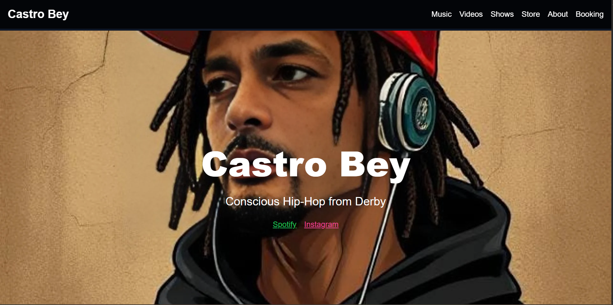

Castro Bey
Project Overview
Welcome to Castro Bey, a web application designed to showcase the music and creative work of the artist Castro Bey. Built with React and styled using custom CSS, this app offers a dark-themed, responsive interface to engage fans with a seamless experience across devices. It features sections for music releases, videos, upcoming shows, merchandise via Bandcamp, an about page, and booking options, with integrations to Spotify, Instagram, YouTube, and Bandcamp.
🌟 Features

Responsive Design: Optimized for desktop and mobile with a hamburger menu for navigation.
Integrated Platforms: Connects with Spotify, Instagram, YouTube, and Bandcamp for a rich multimedia experience.
Dark Theme: A sleek, dark-themed UI with smooth scrolling and hover effects.
Modular Structure: Utilizes React components for scalability and maintainability.
Content Sections: Includes music, videos, shows, store, about, and booking areas.

Screenshots

Project Structure
The Castro Bey project is a monorepo containing the frontend:
CASTRO-BEY/
├── index.html                 # Frontend entry point
├── script.js                 # Frontend JavaScript logic
├── style.css                 # Frontend styling
├── images/                   # Image assets (e.g., castro-bey-homepage.png)
├── README.md                 # Project documentation

Frontend: Located in the root directory, a static site with index.html as the entry point, styled with custom CSS.

🚀 Getting Started
Prerequisites

Node.js (v18.x or higher recommended)
Git

Installation

Clone the Repository:
git clone https://github.com/Jackafella1/Castro-Bey.git
cd Castro-Bey

Install Dependencies:
npm install

Usage

Run Locally:
npm start

The app will launch at http://localhost:3000.

Testing Locally:Use a local server (e.g., VS Code’s Live Server extension) to open index.html in your browser.

📦 Deployment

Frontend (Vercel):

URL: https://your-castro-bey.vercel.app (replace with your actual Vercel URL)
Root Directory: / (root of the repository where index.html resides)
Steps:
Connect your GitHub repository to Vercel.
Set the root directory to /.
Deploy.

Domain Management: The domain is managed by Fasthosts.

🌐 API EndpointsThis project does not currently use a backend API. All content is statically served from the frontend, with external links to Spotify, Instagram, YouTube, and Bandcamp.
⚠️ Notes

File Naming: Ensure consistent case usage (e.g., images/castro-bey-homepage.png) to avoid issues on case-sensitive systems.
Performance: Optimize images in the images folder for faster loading.

🤝 ContributingContributions are welcome! To contribute:

Fork the repository.
Create a new branch: git checkout -b feature/your-feature.
Commit your changes: git commit -m "Add your feature".
Push to the branch: git push origin feature/your-feature.
Open a Pull Request.

📜 LicenseThis project is licensed under the MIT License. See the LICENSE file for details.
📬 ContactFor questions or feedback, reach out to:

Author: Jackafella
GitHub: Jackafella1
Instagram: castrobey

Happy exploring with Castro Bey! 🎵
